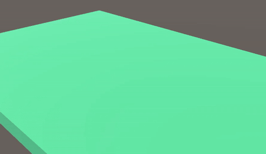

# Unity-VFX-Effect
Unity-VFX-Effect (for Block and Ball project)

## [Project Page](https://github.com/YeoJune/Block_and_Ball_Demo)

    
     
    explosion vfx for Block and Ball project
     

## News 
*2024/07/26: Wave, explosion VFX are pushed.*

*2024/07/28: blender branch extra mesh, texture have pushed*

*2024/07/28: portal VFX is pushed.*

## How to run

**Step 1**: goto Window-Package Manager-Packages:Unity Registry and Download Universal RP, Visual Effect Graph package

**Step 2**: goto Edit-Project Settings-Graphics and check Scriptable Render Pipeline Settings is New Universal Renderer Pipeline Asset
   if it says "None" you can make new URP by create -> Rendering -> URP asset (with Universal Renderer) and select the pipeline in Scriptable Render Pipeline Settings

**Step 3**: goto Scenes folder and open SampleScene

**Step 4**: if there are no effects when you play, you should goto Visual Effect folder and check vfx file one by one if they couldn't load the Shader Graph, Mesh, Texture 2D. you can select Shader Graph, Mesh, Texture 2D by searching Models, shader, Texture folder, also can use Sample Texture or mesh if you want.

You can confirm the results by checking mp4 in Scenes/videos
